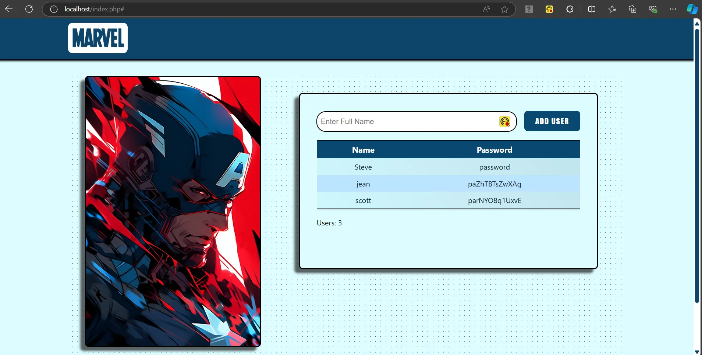

## 📄 Description

This project is a Marvel-themed web application built using PHP, with a secure user management. 
The application allows users to register by entering their username, which is then stored in a MongoDB database. 
Upon registration, the system automatically encrypts the username entered.

* No frameworks
* No AI code
* Local content

The website is optimized for a 15.6" 1920 x 1080 display with a 16:9 aspect ratio.

## 🛢️ Database Connection

- Host: <i>localhost</i>
- Port: <i>27080</i>
- User: <i>felipe</i> 
- Password: <i>password</i>
- Database: <i>marvel</i>
- Collection: <i>users</i>

## 📷 Screenshots

### index.php

♦️ You will need a local server and import the database to display the website on your browser. 

## 📒 How to run a local server using MongoDB 🍃

You can use XAMPP as a free option:

https://www.apachefriends.org/

For MongoDB you need this tools:

*	Mongo Server: https://www.mongodb.com/docs/manual/installation/
*	Mongo Shell: https://www.mongodb.com/try/download/shell
*	Mongo Tools: https://www.mongodb.com/docs/database-tools/installation/installation-windows/

### 🛠️ Install Mongo DB extension for XAMPP

1. Once the previous tools are installed, an extension for Mongo DB to communicate with the system must be installed. You can find the extension here:

   https://pecl.php.net/package/mongodb

2. Once is downloaded, look for the <strong>dll</strong> file. Then go to your Xampp folder and navigate to the  <strong>php/ext </strong> folder.

3. You will want to paste the  <strong>dll </strong> file into this location.

4. Next, go to C:\XAMPP\php from here we need to open and modify the <strong>php.ini<strong> file.

5. Once there open it with your preferred editor. Then scroll down till you locate the extension area and add the following line:

   extension=php_mongodb.dll
   
6. Save and close the php.ini file. Next, stop and restart your Apache server.

### Run XAMPP

If you followed the default installation parameters, the directory to run the local server should be on this path: 

   C:\XAMPP

Steps to start the server:

1. In C:\XAMPP look for the <strong>xampp-control</strong> file and open it. Next, start the <strong>Apache</strong> and <strong>MySQL</strong> servers.

2. At the same directory level where the xampp-control file was located, look for the <strong>htdocs</strong> folder and delete it.

3. Replace the removed <strong>htdocs</strong> folder with the one on this project.

